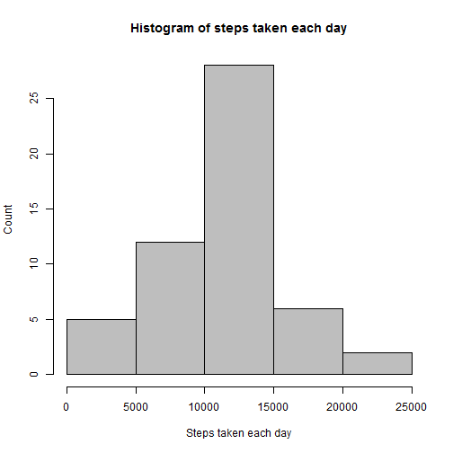

###Loading and processing data

First of all we have load the nescessary libraries.


```r
library(dplyr)
library(lattice)
```


Then we can read and process the data. In my case I only transformed the date variable to Class Date.


```r
dat <- read.csv("C:/Users/Andreu/Documents/Documentos/Data Science coursera/Reproducible research/activity.csv",
                stringsAsFactors = F)
dat$date <- as.Date(dat$date, format = "%Y-%m-%d")
```

Now we can take a look at the data


```
##   steps       date interval
## 1    NA 2012-10-01        0
## 2    NA 2012-10-01        5
## 3    NA 2012-10-01       10
## 4    NA 2012-10-01       15
## 5    NA 2012-10-01       20
## 6    NA 2012-10-01       25
```

```
## 'data.frame':	17568 obs. of  3 variables:
##  $ steps   : int  NA NA NA NA NA NA NA NA NA NA ...
##  $ date    : Date, format: "2012-10-01" "2012-10-01" ...
##  $ interval: int  0 5 10 15 20 25 30 35 40 45 ...
```

###What is mean total number of steps taken per day?

Ignoring the missing (```NA```) values:


```r
datCleaned <- dat[!is.na(dat$steps),]
```

**1. Calculate the total number of steps taken per day**


```r
stepsDay <- summarize(group_by(datCleaned,date), steps = sum(steps, na.rm=T))
```

```
## Source: local data frame [6 x 2]
## 
##         date steps
##       (date) (int)
## 1 2012-10-02   126
## 2 2012-10-03 11352
## 3 2012-10-04 12116
## 4 2012-10-05 13294
## 5 2012-10-06 15420
## 6 2012-10-07 11015
```

**2. Make a histogram of the total number of steps taken each day**


```r
hist(stepsDay$steps, xlab = "Steps taken each day", ylab = "Count", 
     main = "Histogram of steps taken each day", col = "gray")
```



**3. Calculate and report the mean and median of the total number of steps taken per day**

We can extract the mean and the median using ```mean()``` and ```median()```


```r
meanSteps <- mean(stepsDay$steps)
medianSteps <- median(stepsDay$steps)
```


```
## [1] "Mean = 10766.19"
```

```
## [1] "Median = 10765"
```

###What is the average daily activity pattern?

**1. Make a time series plot (i.e. type = "l") of the 5-minute interval (x-axis) and the average number of steps taken, averaged across all days (y-axis)**

I used the following code to summarize the data and plot the time series:


```r
steps5min <- summarize(group_by(datCleaned,interval), steps = mean(steps,na.rm=T))
with(steps5min, plot(interval, steps, type = "l", xlab = "5 minute-interval", ylab = "steps",
                     main = "Average of steps taken across all days for a given 5-min interval"))
```


**2. Which 5-minute interval, on average across all the days in the dataset, contains the maximum number of steps?**

We can use the function ```which.max()``` to find the 5-minute interval that contains the maximum number of steps.


```r
maxInterval <- steps5min$interval[which.max(steps5min$steps)]
```

And we can print the value and add it to the previous plot.


```
## [1] "The 5-minute interval that contains the maximum number of steps is --> 835"
```


###Imputing missing values

There are some missing ```NA``` values in the dataset. The statistics for those missing values are:

**1. Calculate and report the total number of missing values in the dataset**


```r
dat_na <- sum(is.na(dat$steps))
```

```
## [1] "Total of 2304 NA values in dataset --> 13.11 % are NA's"
```

**2. Devise a strategy for filling in all of the missing values in the dataset.**

We are going to fill in the missing values (steps missing) with the averange of steps taken across all days for a given 5-min interval.

First, we assign the original data to the average of steps taken across all days for a given 5-min interval with the following code:


```r
steps5min <- rename(steps5min, steps5min = steps)
datNoNA <- merge(dat,steps5min, by = "interval")
```


```
##   interval steps       date steps5min
## 1        0    NA 2012-10-01  1.716981
## 2        0     0 2012-11-23  1.716981
## 3        0     0 2012-10-28  1.716981
## 4        0     0 2012-11-06  1.716981
## 5        0     0 2012-11-24  1.716981
## 6        0     0 2012-11-15  1.716981
```

**3. Create a new dataset that is equal to the original dataset but with the missing data filled in**

Once done that, we can assign the average to the missing values. Then we make the data look like the original data but with the missing values filled in:


```r
datNoNA[is.na(datNoNA$steps),]$steps <- datNoNA[is.na(datNoNA$steps),]$steps5min
datNoNA <- arrange(datNoNA,date)
datNoNA$steps5min <- NULL
datNoNA <- datNoNA[,names(dat)]
```

The data looks like:


```
##       steps       date interval
## 1 1.7169811 2012-10-01        0
## 2 0.3396226 2012-10-01        5
## 3 0.1320755 2012-10-01       10
## 4 0.1509434 2012-10-01       15
## 5 0.0754717 2012-10-01       20
## 6 2.0943396 2012-10-01       25
```

**4. Make a histogram of the total number of steps taken each day and Calculate and report the mean and median total number of steps taken per day**

Calculate the total number of steps taken per day


```r
stepsDay_NoNA <- summarize(group_by(datNoNA,date), steps = sum(steps, na.rm=T))
hist(stepsDay_NoNA$steps, xlab = "Steps taken each day", ylab = "Count", 
     main = "Histogram of steps taken each day", col = "gray")
```


The mean and the median are:


```r
meanSteps <- mean(stepsDay$steps)
medianSteps <- median(stepsDay$steps)
```

```
## [1] "Mean = 10766.19"
```

```
## [1] "Median = 10766.19"
```

**Question:** Do these values differ from the estimates from the first part of the assignment?
The mean is the same as before and the median is almost the same.

**Question:** What is the impact of imputing missing data on the estimates of the total daily number of steps?
By filling in missing values we corrected the little difference between the median and the mean. Now they are the same.

###Are there differences in activity patterns between weekdays and weekends?

For this part we will use the ```weekdays()``` function.

**1. Create a new factor variable in the dataset with two levels – “weekday” and “weekend” indicating whether a given date is a weekday or weekend day.**

We created an indicator, indicating if a given day is weekday or weekend. With the following code:


```r
datNoNA$weekday <- ifelse(weekdays(datNoNA$date) == 'Saturday' | weekdays(datNoNA$date) == 'Sunday', 
                          'weekend', 
                          'weekday')
datNoNA$weekday <- as.factor(datNoNA$weekday)
```

And the data looks like:


```
##       steps       date interval weekday
## 1 1.7169811 2012-10-01        0 weekday
## 2 0.3396226 2012-10-01        5 weekday
## 3 0.1320755 2012-10-01       10 weekday
## 4 0.1509434 2012-10-01       15 weekday
## 5 0.0754717 2012-10-01       20 weekday
## 6 2.0943396 2012-10-01       25 weekday
```

**2. Make a panel plot containing a time series plot of the 5-minute interval (x-axis) and the average number of steps taken, averaged across all weekday days or weekend days (y-axis).**

Similar to what we did before, but separating the time series with our weekday indicator.


```r
steps5min_NoNA <- summarize(group_by(datNoNA,interval,weekday), steps = mean(steps,na.rm=T))
xyplot(steps ~ interval | weekday, data = steps5min_NoNA, layout = c(1,2), type = "l",
       xlab = "5-minute interval", ylab = "Steps", 
       main = "Average of steps taken across all days for a given 5-min interval, grouping by weekday")
```


